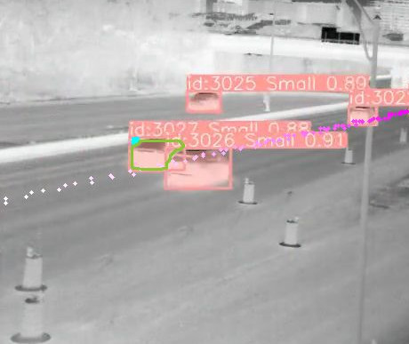

# SmartWorkZoneControl-MassDOT

## Towards Safer Highway Work Zones: Insights from Deep Learning Analysis of Thermal Footage

[Zubin Bhuyan](https://cs.uml.edu/~zbhuyan/), Yuanchang Xie, Ruifeng Liu, Yu Cao, Benyuan Liu

> This research project aims to develop methods to extract vehicle trajectories, use the trajectories to analyze driver behavior, particularly lane-changing behavior under different conditions, and identify safety hazards and opportunities to improve work zone safety and operations. (MassDOT Research Program with funding from FHWA SPR funds.)
>
> https://www.mass.gov/doc/smart-work-zone-control-and-performance-evaluation-based-on-trajectory-data

<table>
  <tr>
    <td> </td>
    <td> </td>
   </tr> 
   <tr>
      <td><i>Medford, MA: Vehicle segmentation.</i></td>
      <td><i>Medford, MA: Roadway segmentation.</i> </td>
  </tr>
  <tr>
    <td> </td>
    <td> </td>
   </tr> 
   <tr>
      <td><i>Danvers, MA: Vehicle segmentation.</i></td>
      <td><i>Danvers, MA:  Roadway segmentation.</i></td>
  </tr>
</table>

Deep learning excels in object detection due to its effective feature recognition capabilities, independent of color information. When integrated with thermal imaging, which detects heat emissions rather than relying on visible light, this approach ensures superior performance under conditions where optical cameras are ineffective.The success of deep learning applications heavily relies on a high-quality, diverse training dataset. Therefore, a substantial effort went into developing a detailed thermal vehicle dataset, designed for the specific conditions of highway work zones. This dataset, critical for training our models to perform effectively in real-world scenarios, was created from thermal footage collected in Medford and Danvers. The dataset categorizes vehicles into three classes: small, medium, and large. Small vehicles consist of sedans, motorbikes, SUVs, and pickups. Medium vehicles cover trucks like garbage and concrete mixers, construction vehicles, and buses. Large vehicles include tractor-trailers.

### Video Processing Framework Highlights:

1. **Model Deployment**: The trained model and tracking module were deployed on two separate computing environments with NVIDIA A100 and RTX 4090 GPUs, enabling parallel video processing of Medford and Danvers locations.

2. **Thermal Video Inference**: Conducted frame-by-frame vehicle detection and tracking on thermal videos, leveraging powerful hardware for near real-time processing.

3. **Output Postprocessing**: Aggregated detection and tracking data per video, compiling results into a structured JSON format for easy analysis and integration with analytical tools.

4. **Video Compression**: Utilized ffmpeg to compress processed videos for efficient storage and sharing. Achieved a compression ratio of ~95%, reducing 1-hour videos from 3.5-4 GB to 60-110 MB.

### Equipment
Data collection was carried out using FLIR TrafiSense AI-632 thermal imaging cameras, with the recorded footage stored locally. The cameras were installed on trailers positioned by the highway and a boom lift for optimal coverage.

Data collection was conducted with FLIR TrafiSense AI-632 thermal imaging cameras, and the footage was stored on local drives. These cameras were strategically mounted on trailers alongside roads and on a boom lift to ensure extensive coverage.

*Deployment of thermal cameras and radar systems for data collection at the Medford site.*

For additional information, please see the [CAMERA_DEPLOYMENT_README](images/equipment/README.md) in the equipment image directory.

#### Occluded vehicles

<table>
  <tr>
    <td> </td>
    <td> </td>
   </tr> 
   <tr>
      <td><i>Medford, MA: Occluding vehicle.</i></td>
      <td><i>Medford, MA: Occluded vehicle.</i> </td>
  </tr>
</table>

#### Vehicle Trajectory Reconstruction

<table>
  <tr>
    <td> </td>
    <td> </td>
   </tr> 
   <tr>
      <td><i>Danvers, MA.</i></td>
      <td><i>Medford, MA.</i> </td>
  </tr>
</table>

#### Detecting vehicles travelling close to work zone

<table>
  <tr>
    <td> </td>
    <td> </td>
   </tr> 
   <tr>
      <td><i>Danvers, MA.</i></td>
      <td><i>Medford, MA.</i> </td>
  </tr>
</table>

#### Medford

<table>
  <tr>
    <td> </td>
   </tr> 
   <tr>
      <td><i>Medford: Sample analysis result.</i></td>
  </tr>
</table>

[images/CHARTS-MEDFORD](images/CHARTS-MEDFORD)

#### Danvers

[images/CHARTS-DANVERS](images/CHARTS-DANVERS)

Campton

(link to campton)

Video data table

