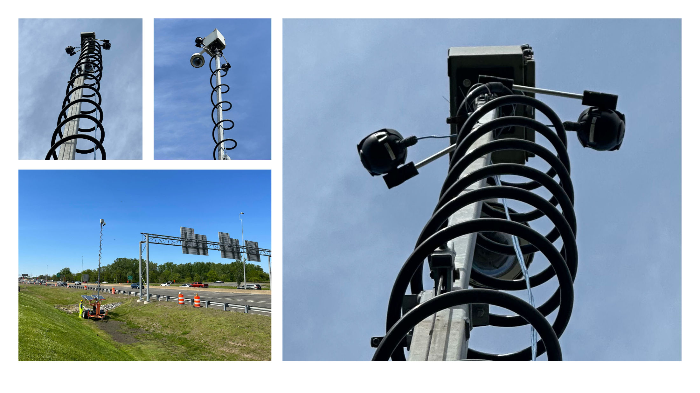
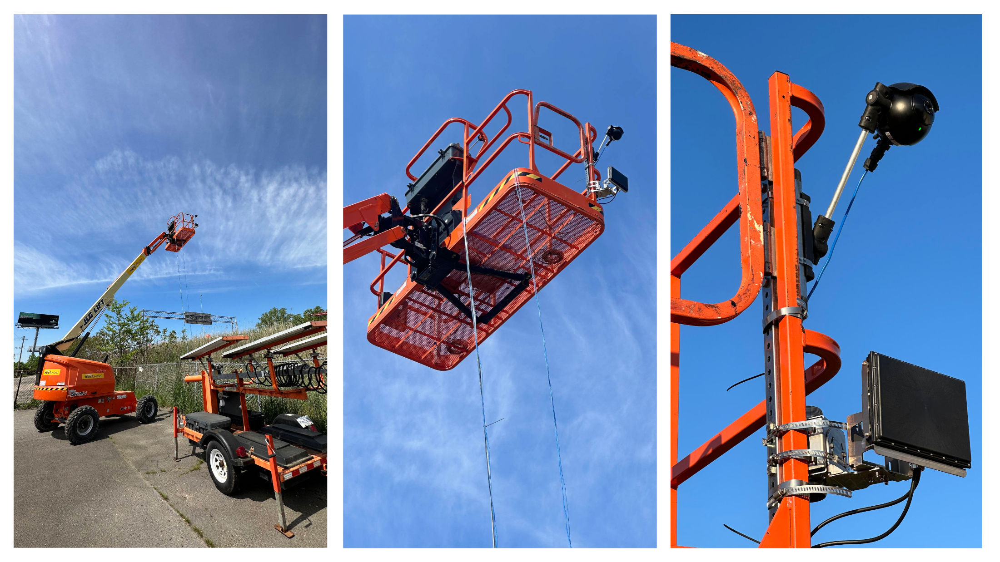
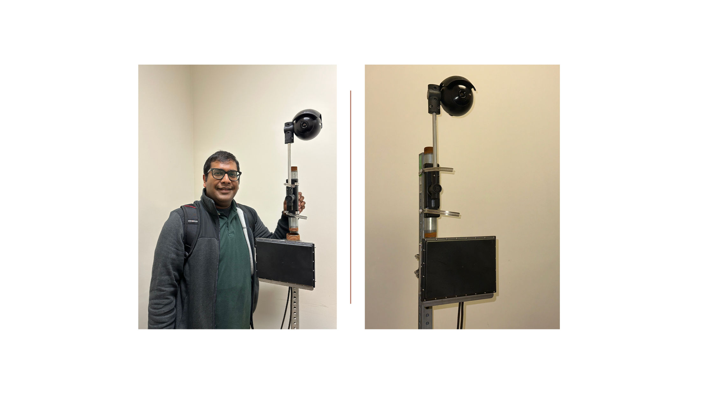

For traffic data analysis, we employed ultra-high-definition (UHD) radar and FLIR TrafiSense AI-632 thermal imaging cameras. The UHD radar, a forward-firing sensor, offers enhanced detection and tracking capabilities over traditional side-firing radars, capable of monitoring vehicles across a 1,000-foot road segment. Despite the preference for overhead mounting to observe lane-specific vehicle trajectories, practical constraints necessitated roadside deployment. (To address this, a clustering algorithm was developed to classify the radar data by lanes, aiding in the analysis of speed variations approaching highway work zones.)

The thermal cameras, mounted on roadside trailers and a boom lift, provided robust data collection at night, overcoming poor lighting challenges. These cameras, with a resolution of 640x480 pixels, were chosen for their balance of performance and cost, allowing for effective night-time observation of driver behavior in work zones. Operating with an average power consumption of 10.5W, peaking at 15W, these systems were instrumental in the collection efforts from May 9 to May 25 in Medford, involving five cameras strategically placed for optimal coverage. Two radar systems were installed at both the Medford and Danvers locations.

FLIR Trafisense thermal camera and radar system. [Zubin Bhuyan](https://cs.uml.edu/~zbhuyan/)
